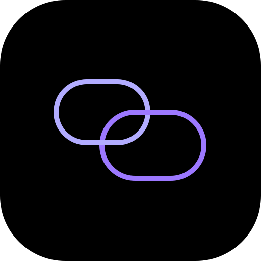

<div align="center">



# Orbita Desktop

**Десктопный клиент мессенджера Orbita со сквозным шифрованием и высокой производительностью**

[](LICENSE)
[](https://www.electronjs.org/)
[](https://react.dev/)
[](https://www.typescriptlang.org/)
[](https://www.rust-lang.org/)

</div>

---

## Описание

**Orbita Desktop** — официальный кроссплатформенный клиент нового поколения для мессенджера Orbita. Приложение сочетает современный графический интерфейс, продвинутые механизмы безопасности и высокий уровень оптимизации благодаря интеграции нативного модуля на языке Rust.

---

## Ключевые особенности

- **Сквозное шифрование (E2EE)**
  Использование криптографического протокола Double Ratchet (X25519, HKDF, AES-GCM / ChaCha20-Poly1305) обеспечивает максимальную конфиденциальность переписки, прямой и обратной секретности сообщений.

- **Оригинальный интерфейс**
  Уникальный графический дизайн с поддержкой динамических тем, кастомных эффектов и адаптивной компоновкой, созданной специально для десктопных операционных систем.

- **Локальное распознавание речи**
  Транскрипция голосовых сообщений выполняется непосредственно на устройстве пользователя при помощи локальных нейросетевых моделей без передачи аудиоданных на внешние сервера.

- **Защита приватности и очистка метаданных**
  Автоматическое удаление служебных метаданных из медиафайлов и документов перед их отправкой в чат.

- **Голосовая и видеосвязь**
  Низкая задержка и высокое качество звука и видео в личных и групповых звонках благодаря технологиям LiveKit и WebRTC.

---

## Технологический стек

| Компонент | Технологии |
| :--- | :--- |
| **Платформа** | Electron, Node.js |
| **Интерфейс** | React 19, TypeScript, Vite, TailwindCSS |
| **Нативный слой** | Rust, N-API, Win32 System Tray, Ring |
| **Инфраструктура** | Supabase, Cloudflare Workers, Vercel Serverless |

---

## Быстрый старт

### Требования к окружению

- **Node.js**: версия 20.0 или выше
- **Rust**: актуальная версия компилятора `rustc` и пакетного менеджера `cargo` (для сборки нативного модуля из директории `native/`)

### Установка зависимостей

```bash
git clone https://github.com/orbitachat/orbita-desktop.git
cd orbita-desktop
npm install
```

### Разработка

Запуск приложения в режиме разработки с поддержкой горячей перезагрузки (Hot Reload):

```bash
npm run dev
```

### Сборка дистрибутива

Компиляция нативного модуля Rust и сборка установочного пакета:

```bash
npm run electron:build
```

Готовый файл установки будет доступен в директории `release/`.

---

## Лицензия

Проект **Orbita Desktop** распространяется под свободным лицензионным соглашением **GNU General Public License v3.0 (GPLv3)**. Полный текст лицензии доступен в файле [LICENSE](LICENSE).
